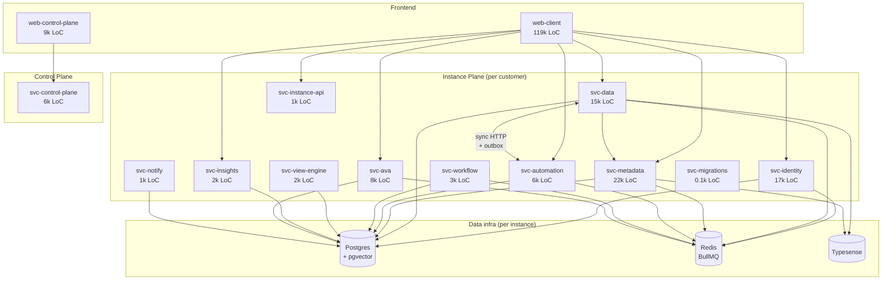
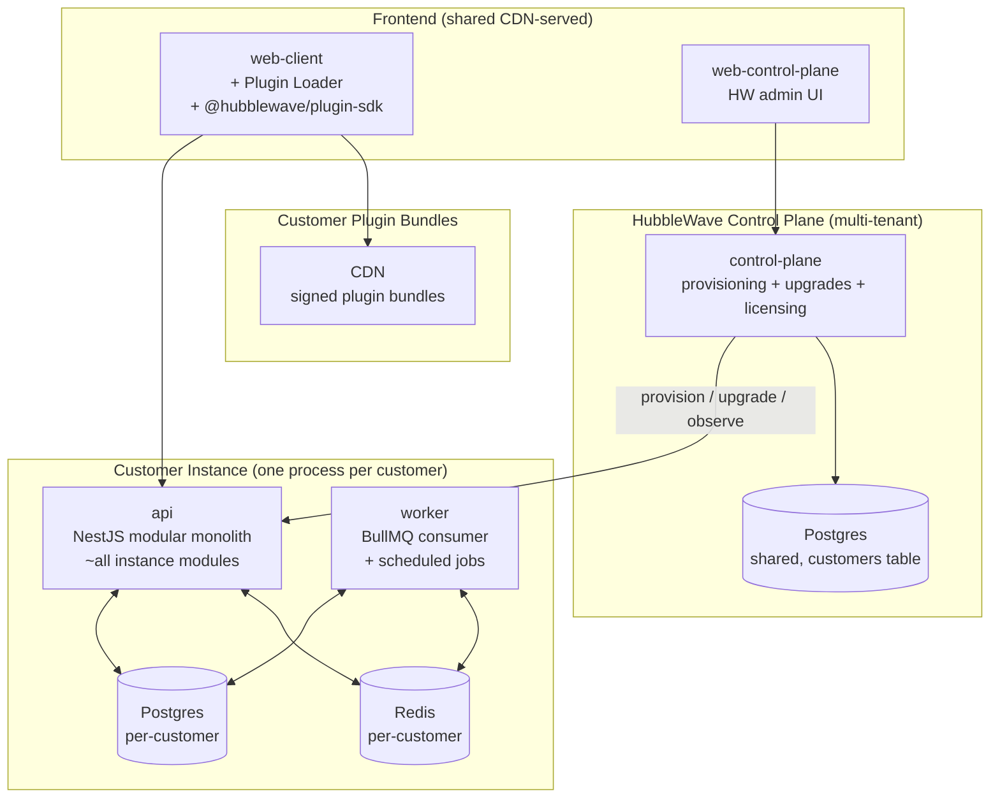
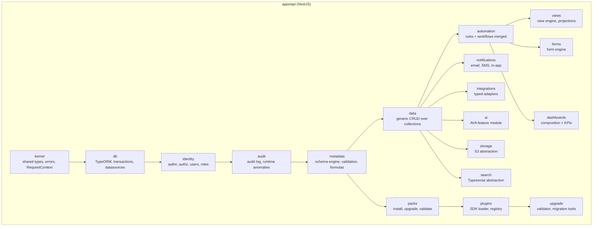
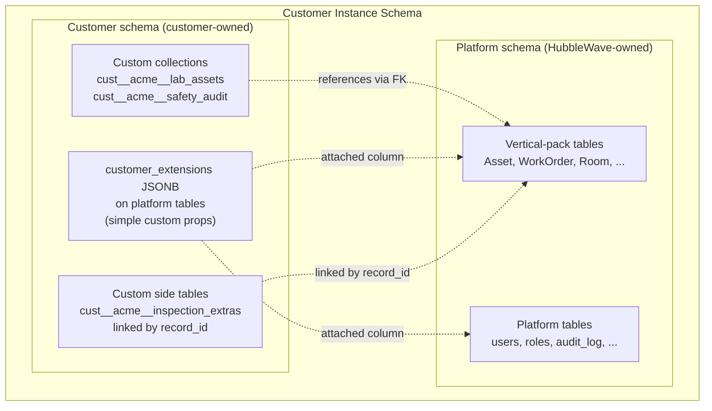
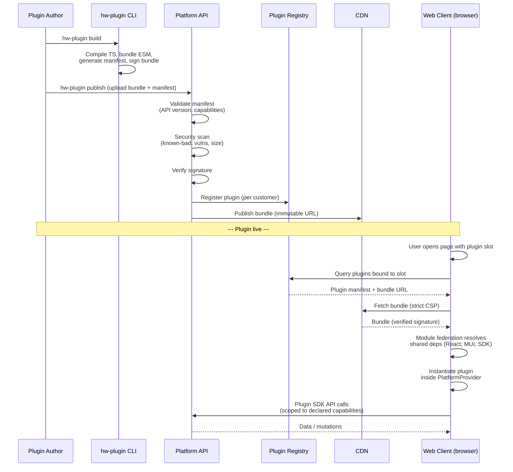
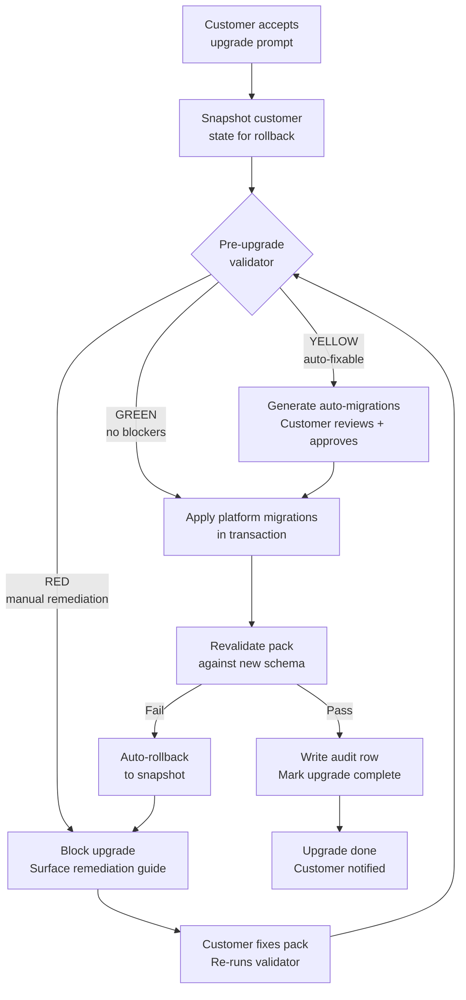
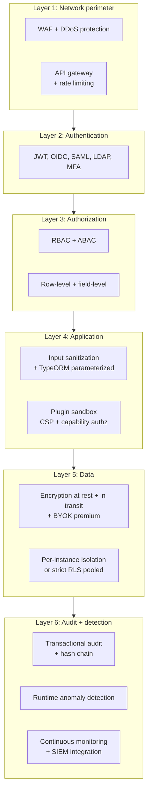
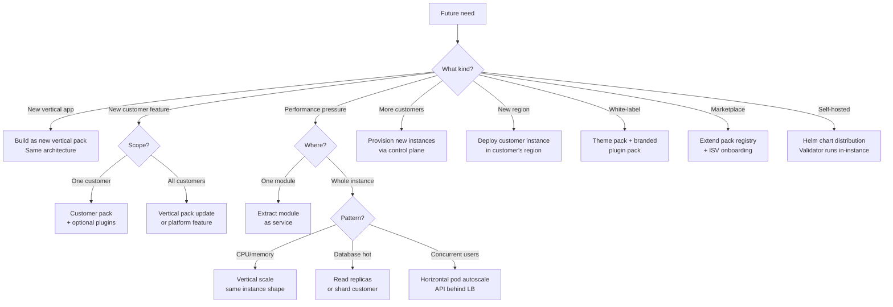
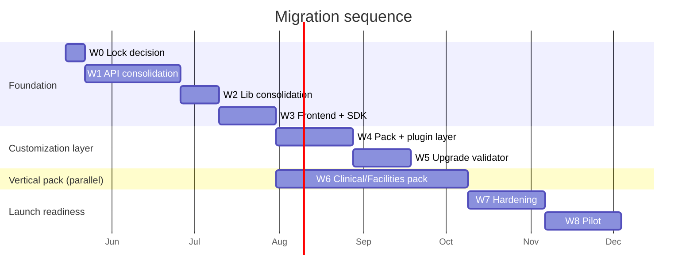

# HubbleWave Platform Architecture Design

**Date:** 2026-05-09
**Status:** Design — Awaiting Approval
**Author:** Aditya Singampally + Claude (collaborative)
**Supersedes:** Aspects of `CLAUDE.md` (Master Canon) — see §9 (Canon Delta)
**Audience:** Founder, future engineers, security reviewers, prospective first customer (technical readers)

---

## Executive summary

HubbleWave today is structured as a 14-service distributed system with 21 supporting libraries — roughly 278,000 lines of TypeScript that build a generic platform engine, with **zero domain models for the asset-management product the platform is supposed to host**. The architecture has shipped no customer-visible features and is currently operating in pure remediation mode: of the last 40 commits, all are architectural cleanup (Plan Fixes 1, 11, 14, 15, 16; waves W1–W7), none are feature work.

This document proposes a course correction:

1. **Collapse the 14-service distributed system into a 3-process modular monolith** (`api`, `worker`, `control-plane`), preserving every substantive capability that's been built.
2. **Make customization upgrade-safety the marquee architectural feature.** This is the precise gap your first customer (a Nuvolo user) has — and an architectural problem ServiceNow can't solve retroactively.
3. **Build the Clinical/Facilities Asset Management vertical pack on top of the same customization layer customers will use** — eat your own dog food, prove the platform claim by living on it.
4. **Ship in one shot, no phased pitches.** Day-1 product includes custom tables, custom workflows, custom UI plugins, custom integrations, AND a precise upgrade-safety guarantee. ~6–9 months critical path.

The architecture preserves the substantive engineering investment (`schema-engine`, `formula-parser`, `relationship-resolver`, `authorization`, `automation` runtime) by relocating it from independent services to typed Nest modules. The structural overhead (cross-service transactions, service-boundary scanners, duplicate runtimes, the 14-service operational tax) is dropped.

---

## Table of contents

1. [Current state](#1-current-state)
2. [Target architecture](#2-target-architecture)
3. [Tech stack](#3-tech-stack)
4. [Feature inventory](#4-feature-inventory)
5. [Customization architecture (the moat)](#5-customization-architecture-the-moat)
6. [Security model](#6-security-model)
7. [Evolution map](#7-evolution-map)
8. [Migration sequence](#8-migration-sequence)
9. [Canon delta](#9-canon-delta)

---

## 1. Current state

### Inventory (measured)

| Layer | Count | Lines of code | Notes |
|---|---|---|---|
| Backend services | **14** | ~83,500 | 12 Nest apps + 2 entry points; mostly `apps/svc-*` |
| Shared libraries | **21** | ~67,000 | `libs/*` |
| Frontend apps | 2 | ~128,400 | `web-client` (490 files), `web-control-plane` |
| CI scanners | 6 | — | authz, audit, security, service-boundary, deps, terminology |
| Documentation | 64+ files | — | 8 phases × 8 sub-docs each, plus canon and plan fixes |
| Plan-fix backlog | **8+ tracked** | — | #1 done; #11, #14, #15, #16 referenced; #8, #12, #13, #24 also called out |
| **Total TypeScript** | | **~278,900 LoC** | |

### What's actually built vs scaffolded

- **Genuinely substantive**: `libs/schema-engine`, `libs/formula-parser`, `libs/relationship-resolver`, `libs/authorization`, `libs/instance-db`, the runtime in `svc-automation`, the identity layer in `svc-identity`, the metadata layer in `svc-metadata`. Combined ~50–60k LoC of work that ports forward cleanly.
- **Structural overhead**: 11 of the 14 service entry points (each with main.ts, module.ts, app.module.ts, Dockerfile, e2e harness, scanner allowlists). The cross-service plumbing exists to satisfy decomposition that the team didn't need.
- **Domain gap**: A grep of `libs/instance-db/src` for `asset|equipment|facility|clinical|patient|hospital|hvac|maintenance|workorder` returns 6 files, all platform infrastructure (permissions, AVA, collection-definition, app-builder, access-rule, runtime-anomaly). **No `Asset`, `WorkOrder`, `MaintenanceSchedule`, `Equipment`, `Patient`, `Bed`, `MedicalDevice` entities exist.**

### Recent velocity (last 40 commits)

- Architectural remediation / consolidation (W1–W7, Plan Fixes): ~32 commits
- Compliance scanners and CI gates: ~6 commits
- Canon amendments: 2 commits
- Customer-visible features: **0 commits**

### Current topology



### Ground truth

The architecture is structured for a 50-engineer platform org running at scale; the team is 1–2 people building toward a first paying customer. The mismatch is what's eating engineering hours. Plan Fix 1 alone took 5 PRs to consolidate two duplicated runtimes that the architecture-as-designed allowed to drift; the next 7 plan fixes are similar shape. The CI scanners are treating symptoms of the architectural choice, not the underlying mismatch.

This document proposes correcting that mismatch.

---

## 2. Target architecture

### Topology

Three backend processes, two frontends, one Postgres, one Redis per customer instance. Control plane stays separate (correctly multi-tenant per Canon §18).



### Module layout inside `api`



### What stays vs drops

**Stays (becomes a Nest module or library)**:
- All `libs/schema-engine`, `libs/schema-validator`, `libs/formula-parser`, `libs/relationship-resolver`, `libs/authorization` content
- The `svc-automation` runtime (rule engine, condition evaluator, action handler, script sandbox)
- The `svc-identity` content (JWT, OIDC, LDAP, MFA, RBAC)
- The `svc-metadata` content (collection/property/relationship CRUD, publish-impact analyzer, packs install path)
- The `svc-data` content (CRUD, sync-trigger client folds back into automation module)
- The `svc-ava` runtime (becomes `ai` module — same code, different home)
- The `web-client` content (490 files, ~119k LoC) — bulk preserved; refactored to consume Plugin SDK internally
- All 6 instance Postgres schemas (consolidated into a single migration set)

**Drops or merges**:
- 11 of the 14 backend service entry points (Dockerfiles, main.ts, app.module.ts, e2e harnesses)
- `svc-workflow` — folds into `automation` (one engine; ServiceNow's split is a tax we don't pay)
- `svc-instance-api` — folds into `api` (it was an aggregator/proxy)
- `svc-view-engine`, `svc-insights`, `svc-notify` — fold into respective modules
- 4 of 6 CI scanners: `service-boundary` (irrelevant for monolith), `terminology` (lint rule instead), `security-bypass` (covered by audit + authz scanners), `audit-bypass` (kept simpler form)
- The cross-service distributed-transaction problem documented in Plan Fix 1's "Out of scope"
- Plan Fix 12 (service-boundary scanner) and Plan Fix 24 (per-service entity sets) — backlog items become irrelevant

**New (introduced by this design)**:
- `apps/control-plane` — formerly `svc-control-plane`, kept distinct because it's correctly multi-tenant
- `apps/worker` — single BullMQ consumer process for async automation, scheduled jobs, AVA tasks
- `@hubblewave/plugin-sdk` package — typed contract for customer plugin authors
- Plugin loader in `web-client` (Vite module federation runtime)
- Pack manifest format
- Pre-upgrade compatibility validator

### Why this is evolution-friendly

Module boundaries inside the monolith become the natural seams for future service extraction *if and when* a specific module hits a real performance ceiling. The boundaries you're committing to today (the Nest module list above) are the same ones you'd use to split into services later — but you don't pay the distributed-systems cost until you have evidence you need to. Shopify ran a Rails modular monolith to billions in GMV before any service extraction; Basecamp/HEY still does. Approach 2+ keeps that option open.

---

## 3. Tech stack

| Category | Tech | Status | Rationale |
|---|---|---|---|
| Language | TypeScript 5.9 | KEEP | Type-safety crucial for plugin SDK contract |
| Backend framework | NestJS 11 | KEEP | Module system maps cleanly to monolith plan |
| ORM | TypeORM 0.3 | KEEP | Custom entities for metadata engine; good migration tooling |
| Database | Postgres + pgvector | KEEP | RLS, JSONB, vectors all in one engine |
| Queue | BullMQ 5 | KEEP | Already in use; well-supported |
| Cache | Redis (cache-manager) | KEEP | Recently consolidated (W5.C) |
| Frontend framework | React 19 | KEEP | Already in use |
| UI library | MUI 7 | KEEP | Already in use; matches enterprise expectations |
| State / data fetching | TanStack Query 5 | KEEP | Already in use |
| Tables | TanStack Table 8 + Virtual | KEEP | Already in use; needed for asset list scale |
| Build (frontend) | Vite 7 | KEEP | Module federation support is reason for this choice |
| Build (backend) | Webpack via Nx | KEEP | NestJS-default; revisit if compile time becomes pain |
| Search | Typesense 2 | KEEP | Already in use; good fit for asset search |
| Storage | AWS S3 | KEEP | Already in use |
| Auth providers | OIDC, SAML, LDAP, JWT | KEEP | OIDC + SAML cover enterprise; LDAP for legacy AD |
| MFA | TOTP (otplib) | KEEP | Add WebAuthn in Wave 7 hardening |
| AI provider | Pluggable (Ollama dev, customer choice prod) | KEEP | Customer-controlled; HIPAA implications |
| Vector DB | pgvector | KEEP | In-Postgres avoids extra infra |
| Workflow visual editor | @xyflow/react 12 | KEEP | For automation/workflow visual builder |
| Code editor | @monaco-editor/react | KEEP | For formula/script authoring |
| Charting | (TBD — likely Recharts or Tremor) | NEW | Currently no chart lib registered |
| Monorepo | Nx 22 | KEEP | Already in use; well-suited |
| Testing (unit) | Jest 30 | KEEP | Already in use |
| Testing (frontend) | Vitest 4 | KEEP | Already in use |
| Testing (e2e) | Playwright 1.36 | KEEP | Already in use |
| Plugin federation | Vite Module Federation | NEW | Required for plugin SDK |
| Plugin sandbox | CSP + capability authz | NEW | Defense-in-depth for plugin code |
| Distributed tracing | OpenTelemetry | NEW (Wave 7) | Production observability |
| Mobile | React Native or Capacitor | DEFER | Not Day-1; addressed in Wave 8+ |
| Approved-deps registry | (existing W6.D) | KEEP | Cheap; broad value |
| Service-boundary scanner | (existing W5.D) | DROP | Irrelevant for monolith |

### What gets newly added (~30k LoC est.)

- `@hubblewave/plugin-sdk` (~3k LoC, typed interfaces + runtime)
- Plugin loader and security model in `web-client` (~5k LoC)
- Pack manifest format + parser + validator (~4k LoC)
- Upgrade compatibility validator (~6k LoC)
- Clinical/Facilities domain entities, services, UI (~12k LoC backend + ~30k LoC frontend, depending on feature scope)

### What gets deleted (~50k LoC est.)

- 11 service entry points + Dockerfiles + e2e harnesses
- Cross-service plumbing (sync-trigger HTTP client, outbox processors duplicated, etc.)
- 4 CI scanners + their allowlist files
- Duplicate Nest modules across services
- Plan-fix tracking docs for fixes that become irrelevant

Net codebase change: roughly flat (-50k +30k = -20k LoC), but with massively reduced operational and cognitive surface.

---

## 4. Feature inventory

### 4.1 Platform features (the engine)

#### Identity & access
- SSO via OIDC, SAML
- LDAP / Active Directory for legacy enterprise
- OAuth2 for API tokens
- MFA: TOTP (existing); WebAuthn (Wave 7)
- RBAC: roles, hierarchical roles
- ABAC: attribute-based rules combining role + record + user attributes
- Row-level security: per-record authz
- Field-level security: hide/mask sensitive fields per role
- Session management: Redis-backed; idle + absolute timeouts
- API token management: scoped, rotatable, auditable
- SCIM 2.0 for user provisioning

#### Schema engine (metadata)
- Collection definition (custom tables)
- Property definition with 16+ types (text, number, date, datetime, currency, boolean, picklist, multi-picklist, lookup, multi-lookup, formula, JSON, file, image, geo, vector)
- Relationship definition (one-to-many, many-to-many, polymorphic, hierarchical)
- Validation rules (required, regex, range, custom formula)
- Formulas / computed fields (deterministic expression language)
- History tracking (per-property, configurable retention)
- Dependency graph (publish-impact analyzer; existing W2.A)
- Reference checking on delete (existing W2.A)

#### Data engine
- CRUD over any collection (system or customer-defined)
- Bulk operations (insert, update, delete)
- Query builder (filters, sorts, joins, aggregations)
- Full-text search (Typesense backed)
- Vector search (pgvector backed; for AVA semantic queries)
- Soft delete + restore
- Record locking (optimistic + pessimistic)
- Import/export (CSV, Excel, JSON)

#### Automation engine (rules + workflows merged)
- **Rule mode** — synchronous, record-scoped, deterministic (canon §8 "automation"):
  - Trigger types: before/after record events, manual, scheduled, webhook
  - Conditions in formula language
  - Actions: record CRUD, send email/SMS, call HTTP, run sandboxed script
  - Cycle and depth control
  - Per-rule rate limiting (existing W7.C)
- **Workflow mode** — durable, multi-day, stateful (canon §8 "workflow"):
  - State persistence
  - Human task assignment, approvals, escalations
  - Parallel branches, joins, loops
  - SLA timers
- Visual workflow editor (existing @xyflow/react usage)
- Script sandbox (existing) — JS subset with allowlisted globals

#### View engine
- List views (table)
- Kanban
- Calendar
- Timeline / Gantt
- Map (geo-aware)
- Custom view via plugin
- Saved view per role / per user
- Bulk actions on selection

#### Form engine
- Declarative form definition
- Conditional logic (show/hide fields)
- Multi-step / wizard
- Inline validation
- Autosave
- Custom field via plugin

#### Dashboard engine
- KPI tiles
- Charts (line, bar, pie, area, scatter)
- Gauges
- Filterable dashboards
- Per-role dashboards
- Custom widget via plugin

#### Notification engine
- Email (transactional + digest)
- SMS
- In-app notifications
- Push (mobile, future)
- Templates with variables
- Per-user delivery preferences

#### Integration platform
- Typed integration adapter framework (REST, GraphQL, SOAP, file-based)
- Versioned contracts (per-integration API version pinning)
- Retry + replay with idempotency keys
- Webhook receiver with HMAC signature verification
- Outbound webhook fanout
- Scheduled sync jobs

#### AVA (AI assistant) — feature module
- Smart search (vector + keyword hybrid)
- Natural-language work order intake ("create a PM for all infusion pumps every 6 months")
- Automation rule authoring assistance (describe → suggested rule)
- Schema evolution suggestions
- Domain-specific Q&A grounded in customer data

#### Pack system
- Pack install / uninstall / upgrade / rollback
- Pack manifest validation
- Dependency resolution between packs
- Pack export/import for backup or migration
- Maintenance-mode lock during install/rollback (existing W4.D)

#### Plugin system
- Plugin SDK (`@hubblewave/plugin-sdk`)
- Plugin registry (per-customer install state)
- Plugin permissions (capability-based)
- Plugin loader (module federation)
- Plugin admin approval flow

#### Upgrade safety
- Pre-upgrade validator (schema, API, plugin, workflow, integration diffs)
- Automated migration generator (yellow path)
- Customer remediation workflow (red path)
- Audit row per upgrade

### 4.2 Clinical/Facilities Asset Management pack features

The OOTB vertical app — what your customer signs up for.

#### Asset management
- Asset inventory (medical devices, HVAC, MRI, infusion pumps, biomedical equipment, building systems)
- Asset hierarchy (system → subsystem → component)
- Asset categories with category-specific fields:
  - Medical device class (FDA Class I/II/III)
  - FDA UDI (Unique Device Identifier)
  - Sterilization status / cycle counts
  - Calibration intervals + last/next due
  - IR / vibration / ultrasound meter readings
  - Manufacturer recall status
- Asset lifecycle (commissioned → in-service → maintenance → retired → decommissioned)
- Photos, manuals, schematics, warranty docs (S3-backed)
- Mobile asset lookup (QR/barcode scanning)

#### Work order management
- Reactive work orders (corrective maintenance)
- Preventive maintenance schedules (interval-based, condition-based, runtime-based)
- Inspections (Joint Commission, fire safety, biomedical)
- Calibrations (with traceable certificates)
- Permit-to-work (lockout/tagout, hot work, confined space)
- Multi-shop assignment + dispatch
- Technician mobile UI (lookup, status update, parts request, photo capture)

#### Space and location management
- Hospital → building → floor → room → bed hierarchy
- Space utilization tracking
- CAD / floor plan integration (DWG, IFC)
- Patient care area mapping (which assets serve which patient zones)
- Room-equipment assignment

#### Compliance & regulatory
- Joint Commission audit trails (full history, exportable)
- FDA recall management workflow
- Equipment downtime impact tracking (patient-care criticality)
- 21 CFR Part 11 e-signatures for FDA-regulated processes
- HITECH HIPAA logging
- AEM (Alternative Equipment Maintenance) program documentation
- Regulatory readiness dashboard

#### Vendor & contract management
- Vendor records, contacts, certifications
- Service contracts with SLA tracking
- Warranty management with expiration alerts
- Service history per asset per vendor
- Vendor portal (self-service work order updates)

#### Inventory & parts
- Parts catalog
- Inventory levels per warehouse/bin
- Parts requisition workflow
- Reorder point automation
- Vendor cross-reference

#### Reporting & dashboards
- Equipment uptime / MTTR / MTBF
- PM compliance %
- Cost-center spend
- Vendor performance scorecards
- Regulatory readiness indicators
- Asset utilization heatmaps

#### Integrations
- HL7 v2 / FHIR R4 for patient context (which equipment is in active use, in which OR/ICU)
- BACnet / Modbus for building management systems
- Legacy CMMS/EAM connectors (Maximo, Infor, Nuvolo) for migration
- ERP (SAP, Oracle, Workday) for procurement and accounting
- EHR (Epic, Cerner) for patient-care criticality tags
- Active Directory / SCIM for identity
- Email / SMS gateway providers
- Mobile app (technician + manager)

### 4.3 Customization surface (what customers can extend)

**Day 1**:
- Add custom collections (tables) with custom properties — no code
- Add custom properties to platform collections (Asset, WorkOrder, etc.) — no code
- Define custom relationships — no code
- Define custom validation rules — formula language, no code
- Define custom formulas / computed fields — formula language
- Define custom automations (rules + workflows) — visual editor + optional sandboxed script
- Define custom views (list, kanban, calendar, gantt, etc.) — declarative, no code
- Define custom forms with conditional logic — declarative
- Define custom dashboards — declarative
- Define custom roles + permissions — no code
- Define custom integrations — typed adapters with config; pluggable for new protocols
- **Upload custom React UI components** — via Plugin SDK (the differentiator vs Nuvolo)
- Customize email/notification templates — declarative
- Customize navigation/menu — declarative
- White-label theming (logo, colors, fonts) — declarative

**Customizable but admin-gated**:
- Plugin install (requires platform admin approval per plugin)
- High-privilege automation actions (e.g. delete-cascade, mass-update)
- Custom integration secrets (admin-managed)

---

## 5. Customization architecture (the moat)

This is the section that makes the platform claim defensible. Your first customer's complaint about Nuvolo is that customizations break on upgrade — not that customization is impossible. ServiceNow allows nearly all the customization you'd want; it just doesn't *isolate* customizations from platform internals, so each upgrade is a roll of the dice.

We can do this better because we're greenfield. The customization surface IS the contract, and the contract is enforced by the platform engine. Customers can't customize their way around it because there's no path off the contract.

### 5.1 The pack model

A "pack" is a versioned bundle of customizations. Three tiers:

1. **Platform packs** — base capabilities shipped by HubbleWave (identity, metadata, automation, etc.). Updated only via platform upgrades. Customers cannot modify these.
2. **Vertical packs** — pre-built apps shipped by HubbleWave (Clinical/Facilities Asset Management today; future Pharmacy, EHS, etc.). Updated via platform upgrades; customers can EXTEND but not modify the base pack.
3. **Customer packs** — customizations authored by customers. Owned by customer; never modified by platform upgrades.

Each pack contains:
- **Manifest** (`pack.json`) declaring: id, version, target platform API version, declared capabilities, dependencies on other packs
- **Schema definitions** — collections, properties, relationships
- **Automation definitions** — rules and workflows
- **View / form / dashboard definitions** — declarative
- **UI plugin bundles** — references to uploaded React components
- **Integration adapter configs** — typed integrations with versioned contracts
- **Permissions / roles**
- **Seed / reference data** (e.g. picklist values, lookup tables)

A customer instance composes packs:

> Customer instance state = base platform packs + selected vertical pack(s) + customer pack(s)

Pack composition rules:
- **Customer packs ADD** new collections (in customer namespace)
- **Customer packs EXTEND** platform/vertical collections (add custom properties, relationships)
- **Customer packs OVERRIDE** views/forms/dashboards (with explicit upgrade-impact warning if overriding a base view)
- **Customer packs REGISTER** plugins, automations, integrations

### Diagram 1 — Pack architecture & schema isolation



### 5.2 Schema isolation

**Customer customizations NEVER modify platform schema.** This is the architectural guarantee that enables upgrade safety.

Three strategies for storing customer customizations, picked per use case:

#### Custom collections → customer-namespaced tables

Naming: `cust__{customer_pack_id}__{collection_id}`. Migrations for these tables are owned by the customer pack version, not the platform version. Querying is via the same TypeORM and data engine as platform collections — the platform doesn't care whether a collection is platform-defined or customer-defined.

#### Simple custom properties on platform collections → JSONB extension column

Every platform table has a `customer_extensions` JSONB column (one per pack namespace). Customer packs declare property type metadata in the manifest. Platform engine handles serialization, validation, indexing (via Postgres GIN on JSONB).

```sql
-- Platform-owned column on Asset table
customer_extensions JSONB DEFAULT '{}'

-- Customer pack manifest declares:
{
  "extensions": {
    "Asset": {
      "acme.fda_class": { "type": "picklist", "values": ["I", "II", "III"] },
      "acme.last_inspection": { "type": "date", "indexed": true }
    }
  }
}
```

#### Complex custom properties → side tables

For relational extensions or fields needing complex indexes/queries, customer packs create side tables linked by `record_id`. Platform engine joins these automatically when querying.

```sql
CREATE TABLE cust__acme__asset_extras (
  record_id UUID PRIMARY KEY REFERENCES "Asset"(id),
  custom_field_a TEXT,
  custom_field_b INTEGER,
  ...
);
```

#### Custom relationships → customer-namespaced join tables

Never modifies platform foreign keys.

#### Validation / formula rules → pack metadata, evaluated at runtime

These never modify schema; they're interpreted by the platform engine against current schema.

**Why this matters**: when HubbleWave ships a platform upgrade migrating platform schema, customer schema is **completely orthogonal**. Migrations CAN'T conflict because they touch disjoint name spaces. The platform's migration tool literally cannot break a customer's custom collection.

### 5.3 Plugin SDK contract

Custom UI components are the highest-risk customization surface (arbitrary code execution). The Plugin SDK is the contract that makes them safe and upgrade-stable.

#### For the customer (plugin author)

Authoring a plugin:

```typescript
// my-asset-utilization-chart/src/index.tsx
import {
  definePlugin,
  useRecord,
  usePlatformAPI,
  RecordList,
  PlatformProvider
} from '@hubblewave/plugin-sdk';

export default definePlugin({
  id: 'acme.asset-utilization-chart',
  version: '1.0.0',
  targetPlatformApiVersion: '2026.05',
  capabilities: ['read:Asset', 'read:WorkOrder'],
  components: {
    AssetUtilizationChart: ({ assetId }) => {
      const asset = useRecord('Asset', assetId);
      const workOrders = usePlatformAPI('2026.05')
        .data.query('WorkOrder', { assetId, status: 'closed' });
      // ... render chart
      return <Chart data={...} />;
    }
  },
  slots: {
    'asset.detail.sidebar': 'AssetUtilizationChart'
  }
});
```

Build with `hw-plugin build` (CLI shipped with the SDK):
- Compiles TypeScript
- Bundles as ESM with module federation manifest
- Generates plugin manifest from the `definePlugin` call
- Outputs a single signed bundle + manifest JSON

Upload + install via platform admin UI (or `hw-plugin publish` CLI).

#### Stability guarantees

The Plugin SDK API commits to:

- **Stability for N major versions** (proposed N=2, ~2 years given quarterly major releases). Plugins built against `2026.05` work through `2027.05` minimum.
- **Deprecated APIs** still work for one full release cycle (1 year) with console warnings.
- **Removed APIs** ship with automated migration tooling for common patterns; `hw-plugin migrate` runs the migration.
- **No silent breakage**: if a plugin's `targetPlatformApiVersion` matches the platform's current API version (or within the 2-version window), the plugin loads and works. Outside the window, the plugin fails to load with a precise error pointing to the migration tool.

#### Runtime model

When a user opens a page where a plugin is bound to a slot:

1. Web-client encounters slot binding from the active customer pack
2. Plugin loader fetches bundle via CDN with strict CSP enforced
3. Module federation runtime resolves shared dependencies (React, MUI, plugin SDK) against platform-provided versions
4. Plugin instantiates inside a `<PlatformProvider>` context with restricted API surface
5. Plugin uses SDK hooks ONLY for data access — raw `fetch` to other origins is blocked at runtime by CSP
6. Plugin renders within the slot's React tree with normal React lifecycle

#### Security boundary (preview; full detail in §6.4)

- CSP: `script-src 'self' cdn.platform; connect-src 'self'; object-src 'none'; ...`
- Plugin runs in same React tree but with restricted context (no access to other plugins' state, no `window` globals beyond explicitly permitted)
- No `eval`, no `Function()`, no inline scripts (CSP-enforced)
- All data access via Plugin SDK; raw `fetch` to non-platform origins blocked
- Capability authz: plugin manifest declares capabilities (e.g. `read:Asset`), runtime enforces (e.g. plugin without `write:Asset` cannot call `useMutation('Asset')`)
- Plugin install requires platform-admin approval per plugin per customer
- Bundle scanning at upload time: known-bad patterns, dependency vulnerabilities (via Snyk-style scanner), bundle size limits
- Optional: publisher-signed bundles (publisher provides signing key; platform verifies at load)

### Diagram 2 — Plugin lifecycle



### 5.4 Upgrade-safety mechanism

This is the marquee architectural feature — the precise problem your customer is trying to solve.

#### Customer-controlled upgrade flow

Customer environments stay on their current platform version until they accept an upgrade. The accept flow:

#### Step 1: Pre-upgrade validation runs on the customer instance

The validator inspects all installed packs and computes diffs against the new platform version's contract:

**a. Schema diff** — platform schema changes vs customer customizations:
- Removed platform tables that customer references → **BLOCK** (red)
- Removed platform columns that customer references → **BLOCK** (red)
- Renamed columns → **AUTO-MIGRATE** (yellow with rollback support)
- Type changes (e.g. INT → BIGINT) → **AUTO-MIGRATE** if widening; **BLOCK** if narrowing
- New platform columns → no impact on customer (green)
- New platform tables → no impact (green)

**b. API diff** — platform API changes vs customer pack uses:
- Removed REST endpoints used by customer integrations → **BLOCK** (red) with migration guide
- Removed plugin SDK functions used by plugins → check plugin's `targetPlatformApiVersion`; if within window, **AUTO-MIGRATE**; if outside, **BLOCK**
- Deprecated APIs still in use → **WARN** (yellow informational)
- New APIs → no impact (green)

**c. Plugin compatibility** — plugin's declared API version vs new platform:
- Plugin's `targetPlatformApiVersion` older than minimum supported → **BLOCK** with auto-migration tooling URL
- Plugin's `targetPlatformApiVersion` within window → **OK**
- Plugin uses removed SDK function → **BLOCK** with line-level migration guide

**d. Workflow validation** — workflow references vs new schema:
- Workflow references removed table/column → **BLOCK** with offending workflow steps highlighted
- Workflow uses deprecated action → **WARN** with replacement action suggestion

**e. Integration validation** — integration adapter contracts vs new endpoints:
- Integration uses removed endpoint → **BLOCK**
- Integration uses deprecated endpoint → **WARN** with new endpoint mapping

#### Step 2: Validator output classified

- **Green (proceed)**: no blocking issues; minor warnings are advisory. Customer clicks "upgrade now"; platform applies automatically.
- **Yellow (auto-migrate)**: blocking issues exist BUT automated migrations are available. Customer reviews proposed migrations in a diff UI, approves, applies. Auto-rollback on any failure.
- **Red (manual remediation)**: blocking issues without auto-fix. Validator surfaces precise remediation guide:
  - Which pack version, which file, which line
  - What contract was violated
  - Suggested fix (with code if possible)
  - Link to migration tooling
- Upgrade refuses to proceed until red issues are resolved (customer remediates pack and re-runs validator) OR explicit operator override (audited).

#### Step 3: Upgrade applies

- Platform schema migrations run in transaction
- Customer pack revalidated against new platform schema (post-migration check)
- Plugins reloaded with new platform API version
- Audit row written: who upgraded, from version, to version, validator output, applied migrations, customer pack versions before/after

#### The architectural guarantee

> If the validator says **green**, the upgrade IS safe. There is no path where validator passes and customizations break at runtime.

This is enforceable because:
- Customizations live on a typed, versioned contract (the pack manifest + plugin SDK)
- The platform engine is the only consumer of customization metadata at runtime
- The validator runs the same metadata through compatibility checks before the engine sees it
- There's no DOM-hack or side-channel for customizations to enter the system unvalidated

This is precisely what ServiceNow can't promise — their customers customized via DOM and JavaScript injection over 20 years, no contract, no validator possible. We can promise it because we're greenfield and the contract IS the customization surface.

### Diagram 3 — Upgrade flow



### 5.5 Versioning strategy

- **Platform versions**: `YYYY.MM` for major releases (e.g. `2026.05`, `2026.08`, `2026.11`). Quarterly cadence proposed.
- **Pack versions**: semver per pack (e.g. `acme-cmms-extensions@1.4.2`).
- **Plugin SDK versions**: semver, tied to platform API versions (`@hubblewave/plugin-sdk@2026.5.0`).
- **Platform API versions**: same as platform versions (e.g. `2026.05`).

Stability windows:
- Plugin SDK: **2 major versions** of forward compatibility (~6 months minimum guaranteed; typically 1+ year).
- Pack manifest format: **1 major version** with mandatory automated migration to the new format.
- Schema migrations: forward-only with rollback support; no breaking column type changes within a major version.

### 5.6 Customization design-time validation

The richest payoff for the contract is shifted left: customers get errors at *design time*, not at upgrade time.

When a customer authors a workflow that references a column in the platform schema, the platform validator checks against current schema in real time. Removed/renamed column → error in the editor, before they save. Same for:
- Form fields referencing properties
- View columns
- Automation conditions and actions
- Plugin SDK calls (caught by TypeScript at plugin build time)

This shifts upgrade pain LEFT: customers fix incompatibilities when they author, not at upgrade time when they're under pressure to deploy.

---

## 6. Security model

Defense-in-depth across six layers. Every layer is auditable, every layer fails closed, and there's no single layer whose compromise gives an attacker free rein.

### 6.1 Authentication

- **JWT** for session tokens (short-lived access + refresh). Signed with per-instance asymmetric key.
- **OIDC** for SSO (Azure AD, Okta, Google Workspace, Auth0).
- **SAML 2.0** for enterprise SSO with legacy IdPs.
- **LDAP / Active Directory** for legacy enterprise directories.
- **MFA**: TOTP (otplib already in dependencies); WebAuthn (Wave 7).
- **Session management**: Redis-backed; per-session security context; configurable idle (default 30 min) + absolute timeouts (default 12 hours).
- **API tokens**: per-user, scoped, rotatable, full audit trail.
- **Account lockout**: configurable failure threshold + exponential backoff.
- **Password policy**: configurable complexity; common-password blocklist; rotation policy per role.

### 6.2 Authorization

- **RBAC**: role-based, hierarchical roles. Roles can include other roles. System roles (e.g. `platform.admin`, `instance.admin`) plus customer-defined roles.
- **ABAC**: attribute-based rules combining user attributes (department, location), record attributes (criticality, status), and contextual attributes (time, IP).
- **Row-level security**: per-record authz combining RBAC + ABAC. Evaluated at the data-engine query layer, not after-the-fact filtering.
- **Field-level security**: hide/mask sensitive fields per role (e.g. patient identifiers visible to clinicians, masked for facilities staff).
- **Centralized**: every data access flows through the `authorization` library (existing `libs/authorization`). Canon §9 stays.
- **Pluggable**: customer packs can add custom permissions/roles. Plugin manifests declare capabilities; runtime enforces.
- **No fail-open**: authz resolution failure is `NotFoundException`, never empty rules (W1.5 architectural choice; preserved).

### 6.3 Data isolation

- **Default deployment: per-customer instance** with own Postgres database, own Redis, own process. Network and process isolation between customers.
- **Pooled deployment** (optional, lower-tier or dev/trial): shared Postgres with strict RLS keyed by `tenant_id`. Per-tenant tests for RLS boundary integrity. Chaos-engineering style test suite for cross-tenant leakage.
- **Encryption at rest**: AWS-managed keys default; **customer-managed keys (KMS BYOK)** for premium tier. Per-customer key gives the customer the kill switch — revoke key, data is unrecoverable.
- **Encryption in transit**: TLS 1.3 minimum to all public endpoints; mTLS between platform components inside the same instance.
- **Database backups**: per-customer encrypted backups; per-customer retention policy; backup encryption with separate key from runtime data (compromise of one doesn't compromise the other).

### 6.4 Plugin sandbox (detail)

The most interesting attack surface. We treat plugin code as semi-trusted (admin-approved, signed) but defend in depth.

#### Content Security Policy (CSP)

```
Content-Security-Policy:
  default-src 'self';
  script-src 'self' cdn.platform;
  connect-src 'self';
  object-src 'none';
  frame-src 'none';
  base-uri 'self';
  form-action 'self';
```

This blocks:
- Inline scripts (XSS via DOM injection)
- Cross-origin XHR/fetch (data exfiltration)
- Plugin-loaded iframes (phishing within plugin)
- Object/embed tags (Flash-style escapes)

#### Restricted runtime

- Plugin runs in same React tree but with restricted JavaScript context:
  - No `eval`, no `Function()`, no `setTimeout(string)` (CSP enforces)
  - `window` global access mediated by platform shim — direct access to `window.localStorage`, `window.navigator.geolocation`, etc. requires capability declaration
  - No access to other plugins' React state (each plugin gets isolated context provider)
- All data access via Plugin SDK; raw `fetch` to non-platform origins blocked by CSP `connect-src`

#### Capability-based authz

Plugin manifest declares capabilities:

```json
{
  "capabilities": [
    "read:Asset",
    "read:WorkOrder",
    "write:Asset.customer_extensions.acme.fda_class"
  ]
}
```

Runtime enforces:
- Read capabilities checked at SDK hook level (e.g. `useRecord('Asset', id)` validates `read:Asset` capability)
- Write capabilities checked at mutation layer
- Field-level capabilities supported (plugin can be authorized to write specific custom fields without write access to the whole record)
- Capability denial fails closed: SDK call throws `CapabilityNotGrantedError`

#### Install-time approval

- Plugin install requires **platform admin approval** per plugin per customer
- Admin sees plugin manifest, declared capabilities, signature, scan results before approving
- Plugins from "trusted publishers" (registered with HubbleWave) can have streamlined approval

#### Bundle scanning at upload

- Known-bad pattern detection (signatures of common malicious patterns)
- Dependency vulnerability scan (via Snyk-style or `npm audit` integration)
- Bundle size limits (default 5MB; configurable)
- Static analysis for `eval`/`Function`/`document.write` etc.

#### Optional: signed bundles

- Publishers can register a signing key with HubbleWave
- Bundles signed at publish time
- Platform verifies signature at load time; signature mismatch = refuse to load

### 6.5 Audit

- **Every state-changing action writes an audit row in the same database transaction** (Canon §10; W1.6 + W2.D + W3.C). Use `withAudit(dataSource, fn)` helper from `libs/instance-db`.
- **Audit row content**: actor (user, session, IP, user-agent), action (verb + resource + record ID), timestamp, purpose code (optional, customer-required for HIPAA "minimum necessary"), permission context (which role + which ABAC rule was evaluated).
- **Read access auditing**: optional per-collection (HIPAA-required for PHI; configurable).
- **Audit retention**: per-customer policy (default 7 years for HIPAA-eligible deployments; configurable down to 1 year for non-regulated tenants).
- **Audit immutability**: append-only; no updates; no deletes. Cryptographic hash chain (each row hashes the previous row) — optional, enabled for HIPAA tier.
- **Runtime anomaly tracking**: silent skips, fallback behaviors, and unexpected state writes go to the `runtime_anomaly` table (W2.D infrastructure preserved).

### 6.6 Secrets

- **AWS Secrets Manager** for all secrets (already in dependencies).
- **No secrets in env vars** except local development. CI uses Secrets Manager via OIDC federation.
- **Per-customer secret namespace** isolated via per-instance KMS key.
- **Integration credentials** encrypted at rest with per-customer key; rotated per integration per customer.
- **Plugin secrets**: customers can register secrets the plugin needs; platform exposes them to plugins via `usePlatformSecret()` hook with capability check. Secret never appears in plugin bundle.

### 6.7 Network

- **Per-customer instance**: own VPC (or VPC tenant); private DB subnet; public ingress only via platform API gateway.
- **API gateway**: rate limiting (per-user, per-IP, per-tenant), DDoS protection, WAF rules (OWASP top 10).
- **Service-to-service inside instance**: localhost or local network only; no public endpoints for `worker`.
- **Outbound integrations**: per-instance NAT IP for customer-side IP whitelisting.
- **Webhooks**: HMAC signature required (we sign outbound, verify inbound); replay protection via timestamp + nonce.

### 6.8 Compliance posture

- **HIPAA-eligible**: BAA available with HubbleWave; audit trail satisfies §164.312(b); access controls satisfy §164.312(a); transmission security satisfies §164.312(e); data integrity via audit hash chain.
- **21 CFR Part 11**: e-signatures via MFA + audit; non-repudiation guaranteed; record-integrity via append-only audit.
- **SOC 2 Type II**: audit-friendly architecture; clear control mapping; pursued in Wave 7.
- **GDPR**: data residency per-instance (deploy to customer's region); right-to-deletion via per-record purge tooling that triggers downstream cleanup; data subject access via export tooling.
- **HITRUST CSF**: framework alignment for healthcare-specific controls.

### 6.9 Threat model summary

| Threat | Mitigation |
|---|---|
| Plugin code escape | CSP + Plugin SDK restricted runtime + capability authz + admin install + bundle scan + signing |
| Cross-tenant data leakage (pooled mode) | Strict RLS + per-tenant test suite + chaos engineering |
| Privileged-account compromise | MFA + admin session monitoring + JIT access for sensitive ops |
| Data exfiltration via integration | Egress allowlist per integration + audit + rate limit |
| SQL injection | Parameterized queries (TypeORM enforced) + lint rule + scanner |
| XSS in custom UI | DOMPurify (existing dep) + CSP + plugin SDK escaping |
| CSRF | SameSite=Strict cookies + CSRF tokens for mutating endpoints + Origin header validation |
| Supply-chain (deps) | Approved-deps registry (W6.D, kept) + Renovate with security alerts + bundle scan |
| Insider threat | Field-level security + audit + dual-control for high-risk actions + JIT admin access |
| Stolen JWT | Short access TTL + refresh rotation + IP-binding option + revocation list |
| Brute force on auth | Account lockout + exponential backoff + WAF + rate limit |

### Diagram — Defense-in-depth



---

## 7. Evolution map

How does Approach 2+ evolve in each future scenario?

### Scenario 1: Add a 2nd vertical app (e.g. Pharmacy)

**Architecture impact: zero infrastructure change.** New vertical pack (`@hubblewave/pharmacy-pack`), new domain entities (Medication, Prescription, Inventory, Dispensing), new vertical UI screens. Same metadata engine, automation engine, plugin SDK. The platform gets exercised by a second app — proves the platform claim by living on it.

### Scenario 2: Scale to 5–20 customers

**Architecture impact: linear.** Provision more customer instances. Each is single Nest process + Postgres + Redis. Control plane handles provisioning (already designed for this), billing, upgrades, monitoring. Operational cost grows linearly with customer count, not exponentially.

### Scenario 3: A specific module hits performance limit

**Example**: AVA needs GPU-heavy LLM serving and high-throughput vector search. **Solution**: extract the `ai` module as a separate service. Module boundaries make this surgical — well-defined Nest module with explicit interface becomes a HTTP/gRPC service consumed by the rest of the monolith. Other modules unaffected. The split is deferred until evidence demands it; today's prediction of "which module needs extraction" is speculative.

Other natural extraction candidates if ever needed: `search` (Typesense already external), `worker` (already separate), `notifications` (already a queue consumer).

### Scenario 4: Multi-region (US + EU customers)

**Architecture impact: per-region deployment.** Customer instance deploys in customer's region. Control plane is multi-region (active-active), syncing customer registry across regions for HubbleWave admins. Per-customer data NEVER crosses region boundaries. GDPR/data-residency satisfied by deployment topology.

### Scenario 5: White-label / OEM deployment

**Architecture impact: theming + plugin SDK already support this.** Different white-label gets different theme pack + branded UI plugin pack. Same code; different brand surface.

### Scenario 6: Public app marketplace

**Architecture impact: extend the pack registry to public.** Add pack publishing flow, monetization, ratings, ISV onboarding. Same install/upgrade infrastructure already in place. Plugin sandbox + capability authz become more critical (untrusted publishers).

### Scenario 7: Self-hosted deployment (customer runs in their cloud)

**Architecture impact: package as self-hostable distribution.** Helm chart, Docker compose. Control plane optional — customer manages own upgrades against published platform images. Plugin/upgrade-safety mechanism unchanged because the validator runs in-instance.

### Decision tree



### What's hard to undo

These commitments are expensive to reverse, so they should be intentional:

- **Pack manifest format** — once published with customer packs, format changes need migration tooling
- **Plugin SDK API surface** — once plugins are in customer hands, removing/changing APIs has the upgrade-cost we're trying to avoid
- **Customer schema namespace convention** — once customer tables are named `cust__{pack}__{collection}`, renaming is risky
- **Audit row schema** — append-only audit is hard to migrate

The architecture is designed to make these commitments thoughtfully and only when stable. Pack manifest v1 should be reviewed by 2–3 future-self thought experiments before publishing.

---

## 8. Migration sequence

From current 14-service to target modular monolith. Major waves with effort estimates.

### Wave 0 — Lock the architectural decision (1 week)

- Amend canon (this design doc + canon delta in §9)
- Pause Plan Fix work that becomes irrelevant (Plan Fix 12 service-boundary scanner; Plan Fix 24 per-service entity sets; Plan Fix 16 AVA proposal state machine — defer)
- Re-orient remediation backlog around target architecture
- Set up `apps/api`, `apps/worker`, `apps/control-plane` directories (empty Nest scaffolds)

**Gate**: founder approves canon delta; no objection from internal review.

### Wave 1 — API consolidation (4–6 weeks)

- Move modules from each instance service into `apps/api/src/app/{module-name}/`
- Order (per dependency graph): `kernel` → `db` → `identity` → `audit` → `metadata` → `data` → `automation` → `views` → `forms` → `dashboards` → `notifications` → `integrations` → `ai` → `packs` → `plugins` → `upgrade` → `storage` → `search`
- Each module retains its existing tests (Jest + Vitest)
- Service-boundary scanner deleted
- Old services kept running side-by-side via routing rules; new traffic routed to monolith
- Cutover when all integration tests green and shadow comparator (W3 in Plan Fix 1 lineage) detects no drift

**Gate**: all 14 service E2E suites pass against the monolith; latency budgets met; smoke tests green.

### Wave 2 — Library consolidation (2 weeks)

- Merge `libs/event-bus` into modules that use it
- Merge `libs/redis` into kernel (cache abstraction)
- Merge `libs/auth-guard` into `identity` module
- Merge `libs/automation` into `automation` module
- Merge `libs/control-plane-db` into `apps/control-plane`
- Keep: `schema-engine`, `schema-validator`, `formula-parser`, `relationship-resolver`, `authorization`, `ai`, `storage`, `shared-types`, `ui-components`
- Drop: `enterprise` (folded into appropriate module), `analytics` (folded into `dashboards`)

**Gate**: `nx run-many --target=test --all` green; no orphan imports.

### Wave 3 — Frontend consolidation & Plugin SDK foundation (3 weeks)

- web-control-plane folds into web-client (role-gated routes) OR stays separate (decision pending UX requirements; default fold)
- Add `@hubblewave/plugin-sdk` package (`libs/plugin-sdk` published as npm package or internal workspace)
- Add plugin loader in `web-client` (Vite module federation runtime)
- Refactor existing customization UIs (form builder, view builder, automation editor) to consume the SDK internally — eat your own dog food

**Gate**: existing customization UIs work via SDK; no functional regression; plugin loader proven by loading a stub plugin.

### Wave 4 — Customization layer formalization (4 weeks)

- Define pack manifest format (YAML or JSON; version 1.0)
- Implement schema isolation (customer-namespaced tables, JSONB extensions, side tables)
- Build pack install/uninstall/upgrade/rollback flows
- Build customization design-time validation (referential integrity against current schema)
- Define plugin SDK contract (typed interfaces in `@hubblewave/plugin-sdk`)
- Build plugin install + upload + bundle-scan + admin-approval flow

**Gate**: hello-world customer pack installs and runs end-to-end; hello-world plugin uploads, gets approved, loads, and renders.

### Wave 5 — Upgrade-safety validator (3 weeks)

- Schema diff calculator (TypeORM metadata + customer pack schema)
- API diff calculator (OpenAPI snapshot + customer pack API uses)
- Plugin compatibility checker (manifest declared version vs platform API version)
- Workflow validation (workflow refs vs schema)
- Integration validation (adapter contracts vs current endpoints)
- Validator UI (green/yellow/red display + remediation guide)
- Automated migration generator (yellow path, common patterns)

**Gate**: validator correctly classifies a synthetic customer pack across all three colors; auto-migrations apply cleanly with rollback; red path surfaces precise remediation guide.

### Wave 6 — Clinical/Facilities Asset Management vertical pack (8–12 weeks, parallelizable with W4–W5)

- Domain entities (Asset, AssetCategory, WorkOrder, PreventiveMaintenance, Inspection, Calibration, Recall, Vendor, ServiceContract, Room, Floor, Building, Department, Patient-care-area)
- Asset category type system with category-specific fields
- Vertical-specific UI screens (asset list, asset detail, work-order list, work-order detail, PM scheduler, inspection runner, mobile technician UI)
- Compliance modules (Joint Commission audit trail, FDA UDI lookup, AEM program docs, 21 CFR Part 11 e-sign, HIPAA logging)
- Integrations (HL7/FHIR connector, BACnet adapter, Epic/Cerner connector, Maximo migration tool)
- Reports and dashboards (uptime, MTTR, PM compliance %, regulatory readiness)
- Mobile UI (technician work-order processing, asset lookup, parts requisition)

**Gate**: full end-to-end demo: create asset → schedule PM → assign tech → tech does work via mobile → records data → audit trail complete → all visible in reports.

### Wave 7 — Pre-launch hardening (4 weeks)

- Performance testing under realistic customer load (10k assets, 50 concurrent users, 1k WO/month)
- Penetration testing (external firm)
- HIPAA compliance audit (external firm; gap analysis)
- Disaster recovery drill (per-instance backup + restore)
- Customer instance provisioning runbook
- Documentation (admin guide, customer guide, plugin developer guide, integration developer guide)
- WebAuthn MFA addition
- OpenTelemetry tracing across the monolith

**Gate**: pen-test report shows no critical/high findings unaddressed; HIPAA audit shows no compliance gaps for healthcare customers; DR drill restores within RTO.

### Wave 8 — Pilot with first customer (4 weeks)

- Provision pilot instance for current employer
- Customer-led customization workshop (build their first custom pack with them)
- Build at least one customer-specific plugin together (proves the SDK story end-to-end with a real customer)
- Test full upgrade path: deploy initial → ship a platform "upgrade" → run validator → apply
- Iterate on feedback; gather requirements for general availability

**Gate**: first customer signs off; ready for paid GA.

### Total timeline

| Wave | Duration | Parallel? |
|---|---|---|
| W0 Lock decision | 1 wk | — |
| W1 API consolidation | 4–6 wk | — |
| W2 Lib consolidation | 2 wk | — |
| W3 Frontend + SDK foundation | 3 wk | — |
| W4 Customization layer | 4 wk | — |
| W5 Upgrade validator | 3 wk | — |
| W6 Vertical pack | 8–12 wk | with W4–W5 |
| W7 Hardening | 4 wk | — |
| W8 Pilot | 4 wk | — |

**Critical path (sequential W1→W2→W3→W4→W5→W7→W8)**: ~25 weeks (~6 months)
**With parallelization (W6 frontend pack work alongside W4–W5 backend platform work)**: ~22 weeks (~5–6 months)

This is your "one-shot demo to employer" timeline. Allowing ~2 months of buffer for complications and pivots: **realistic GA-quality demo at 7–9 months**.

### Wave gantt



---

## 9. Canon delta

Disposition of every existing canon clause, plus new clauses introduced by this design.

| § | Clause | Action | Note |
|---|---|---|---|
| 1 | This is a brand-new platform | KEEP | Greenfield discipline still right; no "V1/V2/legacy" language |
| 2 | Code is a product surface | KEEP | Naming + clarity discipline still right |
| 3 | Platform, not application | KEEP | Confirmed by user's positioning — Nuvolo competitor on configurability |
| 4 | Metadata is the product | KEEP | Now load-bearing for the customization moat |
| 5 | One instance per customer | **SOFTEN** | Default deployment model; pooled (RLS) mode allowed for trial/lower-tier; canon language updated to "single-tenant default with optional pooled" |
| 6 | Schema before data | KEEP | |
| 7 | Views are first-class | **SOFTEN** | Drop the 5-tier view hierarchy (System → Tenant → Role → Group → Personal); customer-namespaced + role views are sufficient |
| 8 | Automation ≠ Workflow | **INVERT** | Merge into ONE engine with two modes (sync-rule / durable-workflow); ServiceNow's split is a tax, not a feature; canon language amended |
| 9 | Authorization is centralized | KEEP | W1.2 + W1.5 + W5.D enforcement preserved |
| 10 | Auditability is mandatory | KEEP | W1.6 + W2.D + W3.C transactional-audit preserved |
| 11 | AI is infrastructure | **INVERT** | AI is a feature; AVA is a Nest module, not a service or runtime layer; canon amended |
| 12 | Trust earned incrementally | **DEFER** | Aspirational; activate only when AVA takes real actions for customers; deferred from Plan Fix 16 to Wave-8-or-later |
| 13 | Upgrade safety is required | **EXPAND** | Becomes the load-bearing differentiator; new mechanism in §5.4; Plan Fix added for "upgrade compatibility validator" |
| 14 | Delete ruthlessly | KEEP | W2.A reference-checker on metadata delete preserved |
| 15 | Speed never justifies decay | KEEP | |
| 16 | Manifesto is law | KEEP | |
| 17 | High-level architecture | **UPDATE** | Reflect modular monolith topology (3 backends, 2 frontends, per-customer DB) |
| 18 | Control Plane | KEEP | Stays as separate process; correctly multi-tenant |
| 19 | Customer Instance | **UPDATE** | Single Nest process per instance, not 14 services |
| 20 | Enforcement is part of architecture | KEEP | |
| 21 | Enforcement layers | **TRIM** | Drop service-boundary scanner; drop terminology scanner (becomes lint rule); keep audit-bypass + authz-bypass + approved-deps + canon-amendment process |
| 22 | AI agent compliance | KEEP | Applies to me as well as future agents |
| 23 | Canon as execution contract | KEEP | |
| 24 | Canon maintenance | KEEP | Amendment process still right; expand log to include this design doc |
| **NEW §17.5** | **Customizations are versioned, namespaced, and validated against platform-API versions. No customization may modify platform schema. Upgrades are blocked when customer customizations would break.** | ADD | Defines the upgrade-safety contract; this is the moat |
| **NEW §25** | **Plugin SDK is the platform contract.** API stability is committed for N=2 major versions. Removed APIs ship with automated migration tooling. | ADD | Stability promise to plugin authors; the precise commitment ServiceNow can't make |

### Summary of canon energy redirected

- **Stays load-bearing**: §1, §2, §3, §4, §6, §9, §10, §13 (now expanded), §14, §15, §16, §18, §20, §22, §23, §24
- **Softened or inverted to match modular monolith reality**: §5, §7, §8, §11, §12, §17, §19, §21
- **New clauses for the moat**: §17.5 (upgrade safety contract), §25 (plugin SDK stability)

---

## Appendices

### A. What was decided in this design that the reader can challenge

These are the load-bearing decisions; if any of these are wrong, the design has to change:

1. **Modular monolith over microservices** for customer instance — predicated on team size + Shopify/Basecamp precedent. If team grows to 20+ engineers in year 2, revisit.
2. **Schema isolation via customer-namespaced tables + JSONB extensions** — predicated on Postgres being able to handle this gracefully at customer scale. Verify with synthetic load test in Wave 7.
3. **Plugin SDK with module federation** — predicated on Vite module federation being production-stable for our use case. If it isn't (immature ecosystem), fall back to sandboxed iframes with PostMessage.
4. **Automation + workflow merged** — predicated on customers not needing both engines side-by-side. Validate with first customer in Wave 8.
5. **AVA as feature module, not infrastructure** — predicated on AI being a value-add, not a deal-maker for the first customer. If first customer's pitch hinges on AVA, restore AVA-as-infrastructure framing for that customer's instance.
6. **Per-customer instance default** — predicated on customer instances being lightweight enough to provision economically (single Nest process + Postgres). Pooled mode kept available for unprofitable customers (trials, dev).
7. **Upgrade-safety guarantee** — predicated on the contract being complete (no side-channels for customizations). If anywhere a customization can enter the system unvalidated, the guarantee fails. Audit this aggressively in Wave 4.

### B. Out of scope for this document

- **Specific TypeScript interface definitions** — emerge during implementation; design doc names boundaries
- **Database column types and exact entity schemas** — emerge during Wave 6 domain modeling
- **PR-by-PR migration plan** — produced by `superpowers:writing-plans` after this doc is approved
- **UI mockups** — separate concern (frontend-design)
- **Sales/pitch deck content** — derivable from §4, §5, §6 but a different artifact

### C. Glossary

- **Pack** — a versioned bundle of customizations (schema, automation, views, plugins, integrations) with a manifest declaring its API contract.
- **Customer pack** — pack authored by a customer for their own instance.
- **Vertical pack** — pre-built application pack shipped by HubbleWave (e.g. Clinical/Facilities Asset Management).
- **Plugin** — a customer-uploaded React component bundle that runs inside the platform's web client via the Plugin SDK.
- **Plugin SDK** — `@hubblewave/plugin-sdk`; the typed, versioned contract plugins consume.
- **Customization surface** — the set of platform extension points (schema, automation, views, forms, integrations, plugins) that customers can modify; this surface IS the contract for upgrade safety.
- **Customer instance** — a per-customer deployment of the platform: one `api`, one `worker`, one Postgres, one Redis.
- **Control plane** — multi-tenant HubbleWave-owned service that provisions, upgrades, monitors, and bills customer instances.
- **Validator (upgrade)** — pre-upgrade compatibility checker; classifies upgrades as green/yellow/red.

---

## Decision request

This design supersedes parts of `CLAUDE.md` (the master canon). Specifically, it asks the founder to:

1. **Approve the architectural shift** from 14-service distributed system to 3-process modular monolith.
2. **Approve the canon delta** in §9.
3. **Approve the migration sequence** in §8 (~25 weeks critical path).
4. **Approve the customization moat** in §5 as the load-bearing differentiator vs Nuvolo/ServiceNow.

Once approved, the next step is `superpowers:writing-plans` to produce the per-wave implementation plan (PR-level, file-level).

Push back on any section before that step.
